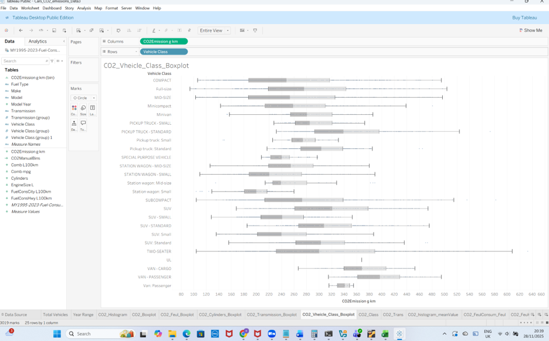
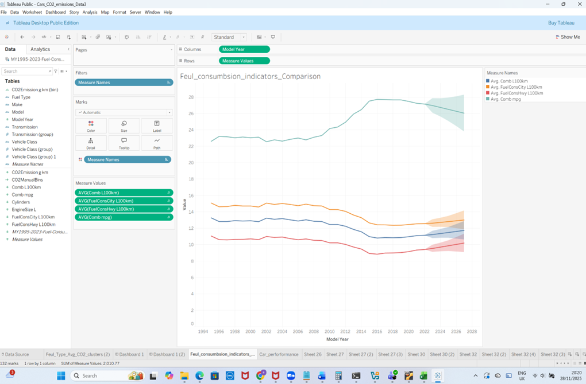

# 🇨🇦 CO₂ Emissions Drivers in Canadian Vehicles (1995–2023)


## 📌 Project Overview
This project investigates the key drivers of vehicle CO₂ emissions in Canada using large-scale data analytics. A PySpark-based machine learning pipeline is developed to analyse fuel consumption, vehicle characteristics, and technological factors influencing CO₂ emissions across model years 1995–2023.

The study combines distributed data processing (Apache Spark) with statistical learning models and Tableau-based visual analytics to deliver scalable, interpretable, and policy-relevant insights.

---

## 🎯 Objectives
- Identify the strongest predictors of CO₂ emissions in Canadian vehicles  
- Compare baseline and regularised regression models with ensemble methods  
- Demonstrate the use of PySpark ML pipelines for large datasets  
- Provide data-driven insights relevant to environmental policy and sustainable transport  

📄 **Full report:**  
👉 [Identifying Key Drivers of CO₂ Emissions in Canadian Vehicles (PDF)](report/Identifying%20Key%20Drivers%20of%20CO₂%20Emissions%20in%20Canadian%20Vehicles.pdf)

---

## 🗂 Dataset
- **Source:** Natural Resources Canada (NRCan), via Kaggle  
- **Coverage:** Model Years 1995–2023  
- **Scope:** Passenger vehicles and light trucks  
- **Target Variable:** `CO2_emissions_g_km`

### Key Features
- Fuel consumption (city, highway, combined)
- Engine size and number of cylinders
- Fuel type
- Vehicle class
- Transmission type
- Model year

---

## 🛠 Tools & Technologies
- Python  
- PySpark (Spark SQL & MLlib)  
- Apache Spark ML Pipelines  
- Tableau (EDA & dashboards)  
- Pandas, NumPy  
- Matplotlib, Seaborn  


## ▶️ How to Run

1. Install **Python 3.9+** and **Apache Spark 3.x**
2. Clone the repository:
   ```bash
   git clone https://github.com/eslamhussienabuelella/co2-canada-vehicles-pyspark.git
   cd co2-canada-vehicles-pyspark
3. Open and run the notebook:  
   [CO2 emission submission jupyter notebook](notebooks/CO2_emission_submission.ipynb)
4. Alternatively, run the PySpark script:   
   [CO2 emission submission Python Script](code/CO2_emission_submission.py)


---

## 🔬 Methodology
### 1️⃣ Data Preparation
- Data cleaning and type casting  
- Categorical encoding using `StringIndexer` and `OneHotEncoder`  
- Feature vector assembly via `VectorAssembler`  
- Train–test split within Spark  

### 2️⃣ Modeling Approaches
- Baseline Linear Regression  
- Ridge Regression (L2 regularization)  
- Random Forest Regressor  

All models were implemented using Spark ML pipelines to ensure scalability and reproducibility.

### 3️⃣ Model Evaluation
Models were evaluated using:
- Root Mean Squared Error (RMSE)  
- Mean Absolute Error (MAE)  
- R² Score  

---

## 📊 Key Results & Insights
- Fuel consumption variables (city, highway, combined) are the dominant predictors of CO₂ emissions  
- Fuel type and engine size have a significant secondary influence  
- Regularization improves model stability with minimal loss of accuracy  
- Random Forest captures non-linear relationships but offers lower interpretability compared to linear models  

These findings highlight the importance of fuel efficiency standards in emissions reduction strategies.

---

## 📈 Visual Analytics
Exploratory and explanatory visualizations were produced using Tableau, including:
- CO₂ emissions distribution across vehicle classes  
- Correlation matrix of numerical variables  
- Fuel consumption trends over time  
- Feature importance analysis  

Example outputs are available in the `/visuals` directory.
## 🖼️ Sample Visuals





---

## 📁 Repository Structure

co2-canada-vehicles-pyspark/  
├─ README.md  
├─ report/  
│ └─ Identifying_Key_Drivers_of_CO2_Emissions_in_Canadian_Vehicles.pdf  
├─ notebooks/  
│ └─ CO2_emission_submission.ipynb  
├─ code/  
│ └─ CO2_emission_submission.py  
├─ visuals/  
│ ├─ CO2_Distribution_Emissions_Vehicle_Classes.png  
│ ├─ CO2_Histogram_BoxPlot.png  
│ ├─ correlation_matrix.png  
│ ├─ FinalRegressionModel.png  
│ ├─ Scatterplots_Fuel_Consumption.png  
│ └─ Yearly_Average_Fuel_Consumption.png  


---

## 🌍 Policy & Practical Implications
- Supports evidence-based environmental policy focused on fuel efficiency  
- Demonstrates limited explanatory power of vehicle class compared to consumption metrics  
- Provides a scalable analytics framework suitable for government and industry datasets  

---

## 👤 Author
**Eslam Abuelella**  
MSc Data Science – Coventry University  

- GitHub: https://github.com/eslamhussienabuelella  
- Portfolio: https://eslamhussienabuelella.github.io  

---

## 📄 License
This project is shared for academic and portfolio purposes.


